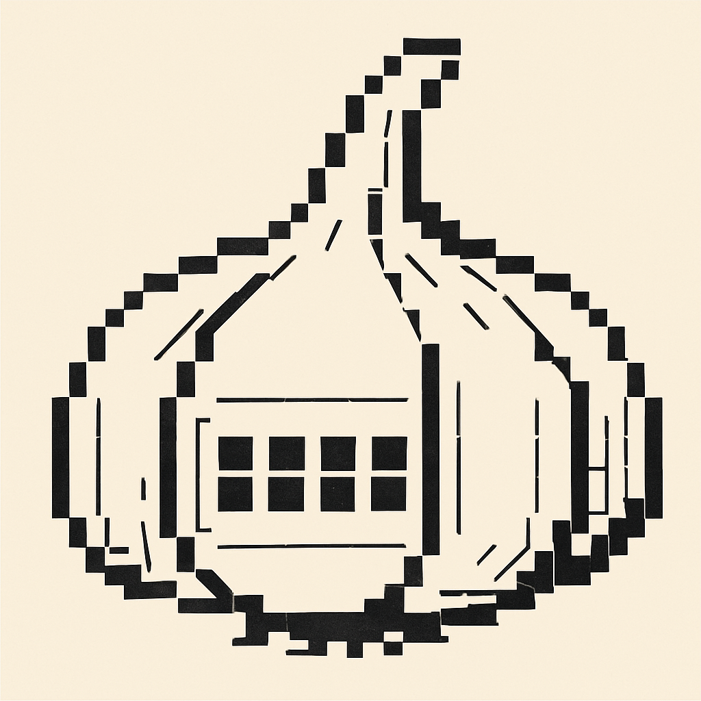
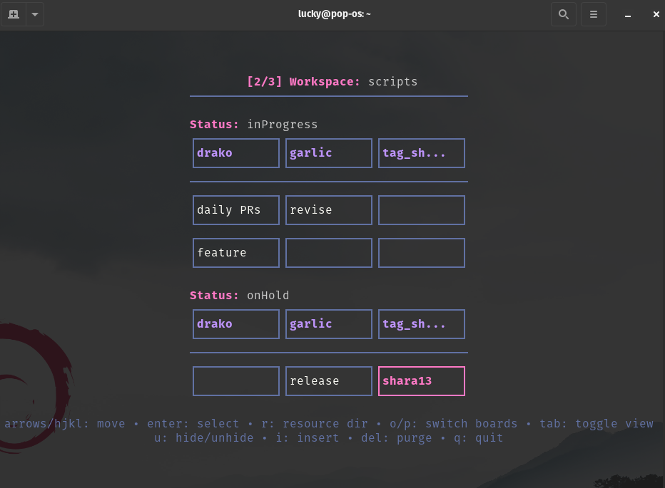

<table><tr>
<td></td>
<td></td>
</tr></table>

# Garlic

*A chronyx.xyz project*

Garlic is a terminal Kanban board built on your filesystem. Garlic offers a reactive, configurable overview of current projects, quick navigation to their resources, and the ability to insert, delete, move, hide and [TODO: archive] — all from within the TUI. 

Building on the well-known [PARA Method](https://fortelabs.com/blog/para/) (Projects, Areas, Resources, Archives), garlic re-imagines it for bash-native workflows with a 'bring your own tools' mindset. 

## 🚀 Installation

Once Go is installed on your system, you can install garlic:

```bash
go install github.com/lucky7xz/garlic@latest
```

### 🔄 Update

To update garlic to the latest version, simply run the installation command again.

If you are not getting the latest version, use this command instead:

```bash
GOPROXY=direct go install github.com/lucky7xz/garlic/cmd/garlic@latest
```

### 🛠️ Post-Installation
Ensure your shell can find the `garlic` binary. Depending on your OS, run the following:

**Linux (Bash):**
```bash
echo 'export PATH=$PATH:~/go/bin' >> ~/.bashrc
echo 'export PATH=$PATH:/usr/local/go/bin' >> ~/.bashrc
echo "Path added to ~/.bashrc. Restart shell to take effect."
```

**macOS (Zsh):**
```bash
echo 'export PATH=$PATH:~/go/bin' >> ~/.zshrc
echo 'export PATH=$PATH:/usr/local/go/bin' >> ~/.zshrc
echo "Path added to ~/.zshrc. Restart shell to take effect."
```

### 🧄 Quick Start

Run the initialization command to generate a pre-peeled workspace that you can tweak to make your own:

```bash
garlic init
```

This will generate a directory structure in `~/shara` containing example projects and resources. It perfectly matches the default configuration paths so you can start using `garlic` without the prep work!
## Why plain-text notes?

- **Simplicity** – no proprietary databases; a file is a file.
- **Versatility** – edit with any editor, back-up to a git server, sync to any device.
- **Security** – plain text works naturally with encryption tools (e.g., `gpg`) and is audit-friendly.

## How it works

Garlic scans only **first-level sub-directories** (of the configured paths), and proceeds to add the relevant **.md/.clove.md** (markdown) files as individual projects to the workspace board.

**Project Tracking:**
Garlic determines a project's status by scanning for a status tag within the file content. 
- Use `#statustag-xxxx` (e.g., `#statustag-inProgress`) to assign a status.
- Use `#garlic-hide` to move a project to the hidden view (toggled with `tab`).

```
~/shara/
├── epics/                        ← Full Bulb (every .md is tracked)
│   ├── fitness/
│   │   ├── running.md             ← (contains #statustag-inProgress)
│   │   └── running/              ← resource folder (indicated by *)
│   │       ├── plan.pdf
│   │       └── progress.csv
│   └── learning/
│       └── golang.md
│
├── scripts/                      ← Semi Bulb (only .clove.md tracked)
│   ├── garlic/
│   │   ├── revise.clove.md        ← tracked
│   │   ├── release.clove.md       ← tracked
│   │   └── main.go
│   └── neofetch/                 ← no .clove.md → invisible to Garlic
│       └── neofetch.sh
```

- **Full Bulb (for Homogenous Workspaces)** – tracks **every** first-level `.md` file. Ideal for pure collections of projects and resources, split into areas. 
- **Semi Bulb (for Heterogenous Workspace)** – tracks only `.clove.md` files on first-level. Perfect for script directories where most things are downloaded noise and only a few need active attention.

Each `path` becomes a workspace (Bulb). Each `status` tag becomes a horizontal section. Each first-level sub-directory becomes a column.

> [!TIP]
> Garlic automatically watches your filesystem for changes. Any edits made externally are reflected in the TUI instantly.


## ⚙️ Configuration

Configure paths, editors, and file manager in `~/.config/garlic/config.toml`.

```toml
editor = "micro"
file_manager = "yazi"

# Alternative commands (use alt+enter or alt+r)
alt_editor = "vim"
alt_file_manager = "dolphin"

# Modifier for alternatives (default: "alt")
alt_modifier = "alt"

# Apps that should launch in the background (GUI tools)
async_apps = ["xdg-open", "open", "dolphin", "gedit", "code"]

[[full-bulb]]
path = "~/shara/epics"
statuses = ["inProgress", "onHold", "toDo"]

[[semi-bulb]]
path = "~/shara/scripts"
statuses = ["inProgress", "onHold"]

[[semi-bulb]]
path = "~/shara/decks"
statuses = ["inProgress", "onHold"]

```

> [!IMPORTANT]
> **Async Launching:** Garlic now supports detached launching for GUI applications. Check the [default config template](internal/config/bootstrap/config.toml) for the new `async_apps`, `alt_editor`, and `alt_file_manager` fields. If you are upgrading, please update your `config.toml` to include these fields.

> [!NOTE]
> The default configuration uses [micro](https://github.com/zyedidia/micro) as the editor and [yazi](https://github.com/sxyazi/yazi) as the file manager. If `editor` or `file_manager` are not specified in the config, Garlic will fallback to your system's `$EDITOR` and `$FILEMANAGER` (defaulting to `xdg-open` or `open` if unset).

## ⌨️ UI cheat‑sheet

### Navigation
- `h/j/k/l` or arrows/wasd – move cursor
- `o` / `p` – switch between different workspaces (Bulbs)
- `tab` – toggle hidden view
- `q` – quit Garlic

### 🛠️ Bring Your Own Tools
Garlic handles the "where", but leaves the "how" to your favorite terminal tools.
- `Enter` / `Space` – Open selected file in your editor
- `r` – Open resource folder in your file manager (projects with resources are marked with a themed `*`)

### Management
- `i` – create a new task file in the current location
- `m` – cycle through available status tags (moves the project)
- `u` – toggle hidden state
- `e` – edit filename 
- `Del` – delete the selected file (confirmation required)

## 🎨 Theming

Set your preferred theme in `~/.config/garlic/config.toml`:

```toml
theme = "dracula" # other options: dracula2, jade, nord, everforest, orasaka
```

> [!NOTE]
> If you use **[Drako](https://github.com/lucky7xz/drako)**, its theme settings will automatically override Garlic's theme.

---
*Built with [Charm](https://charm.sh/) 🧄*
