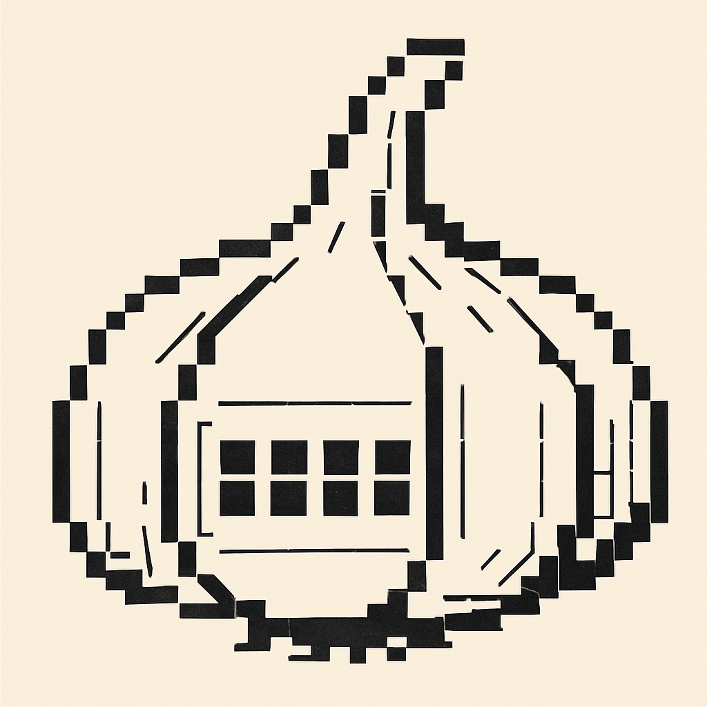
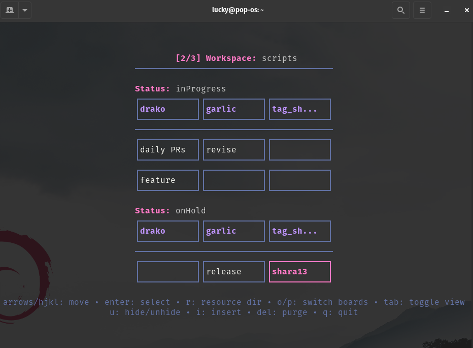

<table><tr>
<td></td>
<td></td>
</tr></table>

# Garlic

*A chronyx.xyz project*

Garlic is a terminal Kanban board built on your filesystem. Garlic offers a reactive, configurable overview of current projects, quick navigation to their resources, and the ability to insert, delete, move, hide and [TODO: archive] — all from within the TUI. 

Building on the well-known [PARA Method](https://fortelabs.com/blog/para/) (Projects, Areas, Resources, Archives), garlic re-imagines it for bash-native workflows with a 'bring your own tools' mindset. 

## 🚀 Installation

Once Go is installed on your system, you can install garlic:

```bash
go install github.com/lucky7xz/garlic@latest
```

### 🔄 Update

To update garlic to the latest version, simply run the installation command again.

If you are not getting the latest version, use this command instead:

```bash
GOPROXY=direct go install github.com/lucky7xz/garlic/cmd/garlic@latest
```

### 🛠️ Post-Installation
Ensure your shell can find the `garlic` binary. Depending on your OS, run the following:

**Linux (Bash):**
```bash
echo 'export PATH=$PATH:~/go/bin' >> ~/.bashrc
echo 'export PATH=$PATH:/usr/local/go/bin' >> ~/.bashrc
echo "Path added to ~/.bashrc. Restart shell to take effect."
```

**macOS (Zsh):**
```bash
echo 'export PATH=$PATH:~/go/bin' >> ~/.zshrc
echo 'export PATH=$PATH:/usr/local/go/bin' >> ~/.zshrc
echo "Path added to ~/.zshrc. Restart shell to take effect."
```

### 🧄 Quick Start

Run the initialization command to generate a pre-peeled workspace that you can tweak to make your own:

```bash
garlic init
```

This will generate a directory structure in `~/shara` containing example projects and resources. It perfectly matches the default configuration paths so you can start using `garlic` without the prep work!
## Why plain-text notes?

- **Simplicity** – no proprietary databases; a file is a file.
- **Versatility** – edit with any editor, back-up to a git server, sync to any device.
- **Security** – plain text works naturally with encryption tools (e.g., `gpg`) and is audit-friendly.

## How it works

Garlic scans only **first-level sub-directories** (of the configured paths), and proceeds to add the relevant **.md/.clove.md** (markdown) files as individual projects to the workspace board.

**Project Tracking:**
Garlic determines a project's status by scanning for a status tag within the file content. 
- Use `#statustag-xxxx` (e.g., `#statustag-inProgress`) to assign a status.
- Use `#garlic-hide` to move a project to the hidden view (toggled with `tab`).

```
~/shara/
├── epics/                        ← Full Bulb (every .md is tracked)
│   ├── fitness/
│   │   ├── running.md             ← (contains #statustag-inProgress)
│   │   └── running/              ← resource folder (indicated by *)
│   │       ├── plan.pdf
│   │       └── progress.csv
│   └── learning/
│       └── golang.md
│
├── scripts/                      ← Semi Bulb (only .clove.md tracked)
│   ├── garlic/
│   │   ├── revise.clove.md        ← tracked
│   │   ├── release.clove.md       ← tracked
│   │   └── main.go
│   └── neofetch/                 ← no .clove.md → invisible to Garlic
│       └── neofetch.sh
```

- **Full Bulb (for Homogenous Workspaces)** – tracks **every** first-level `.md` file. Ideal for pure collections of projects and resources, split into areas. 
- **Semi Bulb (for Heterogenous Workspace)** – tracks only `.clove.md` files on first-level. Perfect for script directories where most things are downloaded noise and only a few need active attention.

Each `path` becomes a workspace (Bulb). Each `status` tag becomes a horizontal section. Each first-level sub-directory becomes a column.

> [!TIP]
> Garlic automatically watches your filesystem for changes. Any edits made externally are reflected in the TUI instantly.


## ⚙️ Configuration

Configure paths, editors, and file managers in `~/.config/garlic/config.toml`.

Garlic supports **Primary and Alternative tools**, allowing you to set up quick dual-workflows. For example, you can use `micro` for editing (`Enter`) and `glow -p` for viewing (`Alt+Enter`), or `yazi` for terminal file management (`r`) and `dolphin` for GUI file management (`Alt+r`). 

Commands support up to **one flag** (e.g., `glow -p`).

```toml
# Primary tools
editor = "micro"
file_manager = "yazi"

# Alternative tools (use alt+enter or alt+r)
alt_editor = "glow -p"
alt_file_manager = "dolphin"

# Modifier for alternatives (default: "alt")
# Does not affect workspace jumping: alt+1..9 is always bound, since terminals
# cannot send ctrl+<digit> as a distinct key.
alt_modifier = "alt"

# Apps that should launch in the background (GUI tools)
# Note: Do not put TUI apps (like vim, micro, glow) in this list.
async_apps = ["xdg-open", "open", "dolphin", "gedit", "code"]

[[full-bulb]]
path = "~/shara/epics"
statuses = ["inProgress", "onHold", "toDo"]

[[semi-bulb]]
path = "~/shara/scripts"
statuses = ["inProgress", "onHold"]

[[semi-bulb]]
path = "~/shara/decks"
statuses = ["inProgress", "onHold"]

```

> [!IMPORTANT]
> **Async Launching:** Garlic now supports detached launching for GUI applications. Check the [default config template](internal/config/bootstrap/config.toml) for the new `async_apps`, `alt_editor`, and `alt_file_manager` fields. If you are upgrading, please update your `config.toml` to include these fields.

> [!NOTE]
> The default configuration uses [micro](https://github.com/zyedidia/micro) as the editor and [yazi](https://github.com/sxyazi/yazi) as the file manager. If `editor` or `file_manager` are not specified in the config, Garlic will fallback to your system's `$EDITOR` and `$FILEMANAGER` (defaulting to `xdg-open` or `open` if unset).

## ⌨️ UI cheat‑sheet

### Navigation
- `h/j/k/l` or arrows/wasd – move cursor
- `o` / `p` – cycle between workspaces (Bulbs)
- `alt+1` … `alt+9` – jump straight to a workspace by number. Numbering follows the order Garlic loads bulbs — all `full-bulb`s first, then all `semi-bulb`s — which is the `[2/3]` counter in the header
- `tab` – toggle hidden view
- `c` – check which projects are planted on your remotes
- `q` – quit Garlic

### 🛠️ Bring Your Own Tools
Garlic handles the "where", but leaves the "how" to your favorite terminal tools.
- `Enter` / `Space` – Open selected file in your editor
- `r` – Open resource folder in your file manager (projects with resources are marked with a themed `*`)

### Management
- `i` – create a new task file in the current location
- `m` – cycle through available status tags (moves the project)
- `u` – toggle hidden state
- `e` – edit filename 
- `Del` – delete the selected file (confirmation required)

## 🌱 Planting and harvesting

Hand a project to another machine — often an agent — let it work, and collect the
results. This machine is always the source of truth; the remote is derived and
disposable.

**1. Point garlic at the machine** in `~/.config/garlic/config.toml`:

```toml
[[remote]]
name          = "agent"
host          = "you@1.2.3.4"
root          = "~/shara"             # a path on the OTHER machine
# port          = 2222
# identity_file = "~/.ssh/agent_key"
```

Needs `ssh`, `rsync` and `sha256sum` at both ends. Nothing is installed over
there — garlic writes a plain tree inside `root` and nothing outside it.

**2. Use the four verbs:**

```bash
garlic plant   epics/fitness/running @ agent   # send it
garlic status                        @ agent   # what changed over there?
garlic harvest epics/fitness/running @ agent   # bring the work back
garlic wipe    epics/fitness/running @ agent   # reset it, then plant again
```

The address is the board's own coordinates — `bulb`, `bulb/area`, or
`bulb/area/project` — so `garlic plant epics` sends a whole bulb. `@ <remote>` is
always required, which is why `garlic plant epics` alone can never reach another
machine. Tab completion fills addresses in; `garlic status` offers to set it up
the first time it finds it missing, or `garlic completion bash` prints the hook
to place yourself.

**What travels:** on a full bulb, a project file plus its resource folder. On a
semi bulb the folder *is* the project, so all of it goes. `.git` never travels,
and you can exclude more per bulb:

```toml
[[semi-bulb]]
path   = "~/shara/scripts"
ignore = ["dist", "node_modules", "target", ".venv"]
```

### 🌱 What is planted where

Press `c` on the board. Garlic asks every configured remote what it is holding
and marks what is out there:

```
│bioz         ││decks🌱      │   ← one project sent / the whole area sent
│mealprep🌱   ││revise       │
│sleeplog     ││release      │

🌱 planted on agent 3d ago • checked 14:20   ← cursor on mealprep
```

The mark shows what you sent, at the size you sent it: plant one project and the
project is marked, plant the area and the column is marked instead. The two times
answer different questions — how long the work has been over there, and how stale
this picture of it is.

Nothing is cached. An unmarked board means you have not asked yet, which is why
the footer stamps the time once you have.

<details>
<summary><b>How garlic knows who changed a file</b></summary>

Planting leaves a manifest on the remote: the hashes of what was handed over.
That gives garlic three states for every file — as planted, as it is on the
remote now, as it is here now — which is exactly what it takes to know *who moved
a file*, rather than merely that it differs.

- **Collected:** the agent changed it and you did not.
- **Parked:** you both changed it. Your file is untouched; the remote's version is
  set down inside the project's resource folder as `<name>.remote.md`. Parking
  counts as handing the conflict over, so the next `plant` will send your version
  — merge first if you want theirs.
- **Reported only:** the agent deleted it. **Garlic never deletes anything of
  yours** — `#garlic-hide` is the delete that travels, because it is content.
- **Left alone:** planting skips anything the agent has touched, the exact mirror
  of the rule above.
- **Left on the remote:** anything in an area you never planted into. Harvest
  collects only what the manifest covers, so a remote's own folders stay its own
  — but inside an area you did plant, whatever the agent adds comes home.

Garlic keeps no state on this machine. The manifest lives on the remote next to
what it describes — one per bulb, inside it — so wiping a bulb takes its record
along with its folder, and `harvest` against a remote with no manifest refuses
rather than guessing.

</details>

<details>
<summary><b>What never travels, and why</b></summary>

`.git` is excluded always, and it is not a size rule but a correctness one: rsync
merges without deleting, so a harvested `refs/` or `index` would land on top of
yours while your objects stayed, leaving branch pointers and worktree
disagreeing.

Everything else is up to you, via `ignore` on the bulb. Patterns match whole path
segments rather than substrings, so `dist` cannot swallow `distributed`.

</details>

<details>
<summary><b>Why wipe asks harder the wider it reaches</b></summary>

An address means the folder dies whole — including work the agent left that you
never harvested. No address means every bulb. Anything in the root that is not a
bulb is never touched, so a `root` shared with the remote's own work survives.

Because typing `epics` when you meant `epics/bioz` is the accident worth
preventing, wipe asks in proportion to what it would take: a project wants its
name typed, an area a confirmation and its name, a bulb the name and the file
count, the whole remote four answers. The count comes from the summary printed
first, so it cannot be typed without reading what is about to go.

</details>

## 🎨 Theming

Set your preferred theme in `~/.config/garlic/config.toml`:

```toml
theme = "dracula" # other options: dracula2, jade, nord, everforest, orasaka
```

> [!NOTE]
> If you use **[Drako](https://github.com/lucky7xz/drako)**, its theme settings will automatically override Garlic's theme.

---
*Built with [Charm](https://charm.sh/) 🧄*
